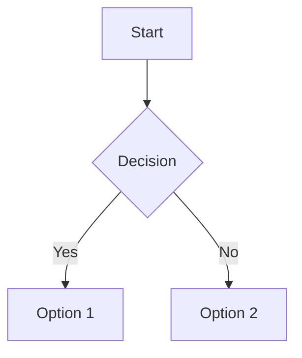
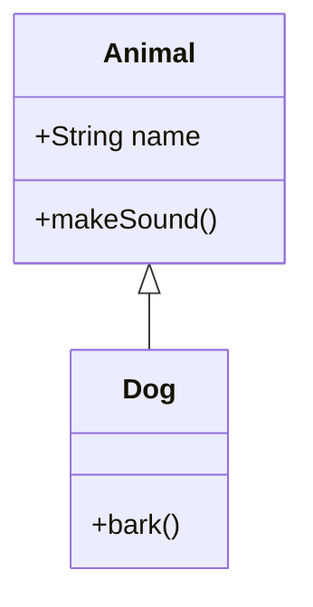
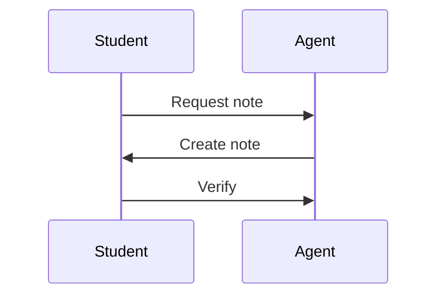

# AGENT.md — How to Use the GRID Platform

> **Read this file first.** It explains everything you need to know to create, edit, and manage notes in the GRID system.

---

## What is GRID?

GRID (Grade Research & Interactive Diary) is a static notes app for 9th-grade students. It's hosted on GitHub Pages. You (the AI agent) write the notes as Markdown files. Students read them in the browser.

**The flow:**
```
You write note files → Push to GitHub → GitHub Pages serves the site → Students read
```

**You do NOT:**
- Edit HTML/CSS/JS (the app is already built)
- Run any build commands
- Manage a database
- Handle authentication

**You DO:**
- Write Markdown note files in `data/notes/`
- Update `data/index.json` when you add/edit notes
- Follow the format rules in `SKILL.md`
- Push to GitHub when done

---

## Repository Structure

```
GRID/
├── index.html              ← DO NOT EDIT (app shell)
├── SKILL.md                ← Note writing rules & templates
├── AGENT.md                ← This file (how to use the platform)
├── css/
│   ├── tokens.css          ← DO NOT EDIT (design tokens)
│   └── style.css           ← DO NOT EDIT (app styles)
├── js/
│   ├── storage.js          ← DO NOT EDIT (data fetching)
│   ├── renderer.js         ← DO NOT EDIT (Markdown rendering)
│   ├── search.js           ← DO NOT EDIT (search logic)
│   ├── export.js           ← DO NOT EDIT (PDF export)
│   └── app.js              ← DO NOT EDIT (main controller)
├── data/
│   ├── subjects.json       ← READ ONLY (subject definitions)
│   ├── index.json          ← YOU MAINTAIN THIS
│   └── notes/
│       ├── physics/
│       │   ├── ch7-motion/
│       │   │   └── newtons-first-law.md    ← YOU CREATE THESE
│       │   └── ch8-force-and-laws/
│       ├── chemistry/
│       │   ├── ch3-atoms-and-molecules/
│       │   └── ch4-structure-of-atom/
│       ├── biology/
│       │   ├── ch1-fundamental-unit-of-life/
│       │   └── ch2-tissues/
│       ├── mathematics/
│       │   ├── ch1-number-systems/
│       │   ├── ch2-polynomials/
│       │   ├── ch3-coordinate-geometry/
│       │   ├── ch4-linear-equations/
│       │   ├── ch5-euclids-geometry/
│       │   ├── ch6-lines-and-angles/
│       │   ├── ch7-triangles/
│       │   └── ch8-quadrilaterals/
│       ├── social-science/
│       │   ├── history-ch4/
│       │   ├── geography-ch2/
│       │   ├── pol-science-ch3/
│       │   ├── pol-science-ch6/
│       │   ├── pol-science-ch7/
│       │   └── economics-ch2/
│       ├── english/
│       ├── kannada/
│       ├── artificial-intelligence/
│       │   ├── unit1-introduction/
│       │   ├── unit2-machine-learning/
│       │   └── unit3-neural-networks/
│       └── art/
├── assets/
│   └── grid-logo.svg       ← DO NOT EDIT
└── templates/
    ├── formula-note.md     ← Copy as starting point
    ├── diagram-note.md     ← Copy as starting point
    ├── definition-note.md  ← Copy as starting point
    ├── comparison-note.md  ← Copy as starting point
    ├── summary-note.md     ← Copy as starting point
    └── example-note.md     ← Copy as starting point
```

---

## Step-by-Step: Creating a Note

### 1. Pick the Right Directory

Notes go in: `data/notes/{subject-id}/{chapter-id}/`

Example: A Physics note about Newton's First Law goes in:
```
data/notes/physics/ch7-motion/newtons-first-law.md
```

### 2. Copy a Template

Pick the template that matches your note type from `templates/`:

| Template | When to use |
|----------|-------------|
| `formula-note.md` | Math/science formulas, equations |
| `diagram-note.md` | Geometry, graphs, visual concepts |
| `definition-note.md` | Concept definitions, explanations |
| `comparison-note.md` | Comparing two concepts |
| `summary-note.md` | Chapter summaries, revision notes |
| `example-note.md` | Worked examples, practice problems |

### 3. Write the Frontmatter

Every note MUST start with YAML frontmatter:

```markdown
---
title: "Newton's First Law of Motion"
subject: physics
chapter: ch7-motion
tags: [definition, theorem]
color: yellow
pinned: false
created: 2026-08-08T10:00:00Z
updated: 2026-08-08T10:00:00Z
---
```

**Required fields:**
- `title` — human-readable title
- `subject` — must match a subject ID from `data/subjects.json`
- `chapter` — must match a chapter ID from `data/subjects.json`
- `created` — ISO timestamp
- `updated` — ISO timestamp (update this when editing)

**Optional fields:**
- `tags` — array of tags (see tag vocabulary in SKILL.md)
- `color` — `red` `green` `yellow` `blue` `purple`
- `pinned` — `true` to pin to top of chapter list

### 4. Write the Content

After the frontmatter, write Markdown content:

```markdown
# Newton's First Law of Motion

## Statement

> An object remains in its state of rest or uniform motion unless acted upon by an external unbalanced force.

## Key Concepts

- **Inertia**: tendency of a body to resist change
- **Equilibrium**: when net force = 0

## Formula

$$
F_{net} = 0 \implies a = 0
$$

## Examples

1. Book on table stays until pushed
2. Passenger lurches forward when bus brakes

## Diagram

<svg width="300" height="200" viewBox="0 0 300 200" xmlns="http://www.w3.org/2000/svg">
  <rect x="50" y="80" width="60" height="40" fill="#D8F3DC" stroke="#2D6A4F" stroke-width="2" rx="4"/>
  <text x="80" y="105" font-family="Inter" font-size="12" fill="#1B4332" text-anchor="middle">Object</text>
  <line x1="110" y1="100" x2="180" y2="100" stroke="#2D6A4F" stroke-width="2" marker-end="url(#arrow)"/>
  <text x="145" y="90" font-family="Inter" font-size="11" fill="#1B4332" text-anchor="middle">No Force</text>
  <text x="145" y="125" font-family="Inter" font-size="11" fill="#62626B" text-anchor="middle">→ No acceleration</text>
  <defs>
    <marker id="arrow" markerWidth="8" markerHeight="6" refX="8" refY="3" orient="auto">
      <polygon points="0 0, 8 3, 0 6" fill="#2D6A4F"/>
    </marker>
  </defs>
</svg>
```

### 5. Save the File

Save as: `data/notes/{subject}/{chapter}/{kebab-case-slug}.md`

**File naming rules:**
- Use kebab-case: `newtons-first-law.md`
- No spaces, no capitals, no UUIDs
- Slug should describe the note content

### 6. Update index.json

Add the note entry to `data/index.json`:

```json
{
  "version": "1.0.0",
  "generated": "2026-08-08T12:00:00Z",
  "notes": [
    {
      "id": "newtons-first-law",
      "title": "Newton's First Law of Motion",
      "subject": "physics",
      "chapter": "ch7-motion",
      "tags": ["definition", "theorem"],
      "color": "yellow",
      "pinned": false,
      "created": "2026-08-08T10:00:00Z",
      "updated": "2026-08-08T10:00:00Z"
    }
  ]
}
```

**Rules:**
- `id` = filename without `.md`
- Update `generated` timestamp
- Keep metadata in sync with frontmatter

### 7. Push to GitHub

```bash
git add data/
git commit -m "notes: add Newton's First Law to physics/ch7-motion"
git push origin master
```

The site auto-deploys from `master` branch.

---

## Step-by-Step: Updating a Note

1. Read the existing note file
2. Update the content
3. Update the `updated` timestamp in frontmatter
4. Update metadata in `index.json` if title/tags/color changed
5. Push to GitHub

```bash
git add data/
git commit -m "notes: update Newton's First Law — add examples"
git push origin master
```

---

## Step-by-Step: Deleting a Note

1. Delete the `.md` file
2. Remove the entry from `index.json`
3. Update `generated` timestamp
4. Push to GitHub

```bash
git rm data/notes/physics/ch7-motion/old-note.md
git commit -m "notes: remove old note from physics/ch7-motion"
git push origin master
```

---

## Subject IDs Reference

| Subject | ID |
|---------|-----|
| Physics | `physics` |
| Chemistry | `chemistry` |
| Biology | `biology` |
| Mathematics | `mathematics` |
| Social Science | `social-science` |
| English | `english` |
| Kannada | `kannada` |
| Artificial Intelligence | `artificial-intelligence` |
| Art | `art` |

---

## Chapter IDs Reference

### Physics
- `ch7-motion`
- `ch8-force-and-laws`
- `ch10-mechanical-properties`

### Chemistry
- `ch3-atoms-and-molecules`
- `ch4-structure-of-atom`

### Biology
- `ch1-fundamental-unit-of-life`
- `ch2-tissues`

### Mathematics
- `ch1-number-systems`
- `ch2-polynomials`
- `ch3-coordinate-geometry`
- `ch4-linear-equations`
- `ch5-euclids-geometry`
- `ch6-lines-and-angles`
- `ch7-triangles`
- `ch8-quadrilaterals`

### Social Science
- `history-ch4`
- `geography-ch2`
- `pol-science-ch3`
- `pol-science-ch6`
- `pol-science-ch7`
- `economics-ch2`

### AI
- `unit1-introduction`
- `unit2-machine-learning`
- `unit3-neural-networks`

---

## Color Labels

| Color | ID | Meaning |
|-------|----|---------|
| Red | `red` | Exam Priority — study FIRST |
| Green | `green` | Mastered — done |
| Yellow | `yellow` | In Progress — needs work |
| Blue | `blue` | Optional — low priority |
| Purple | `purple` | Reference — formulas, cheat sheets |

---

## Tag Vocabulary

**Core tags** (use first):
- `formula` — contains math formulas
- `diagram` — contains diagrams
- `definition` — defines a concept
- `theorem` — states a theorem/law
- `example` — worked examples
- `homework` — practice problems
- `comparison` — compares concepts
- `summary` — chapter summary
- `diagram::geometry` — geometry diagrams
- `diagram::graph` — graphs/charts

**Custom tags** (allowed):
- `board-exam-frequent`
- `important-chapter`
- `ncert-textbook`
- `practical`
- Any freeform string

---

## KaTeX Math Quick Reference

**Inline:** `$E = mc^2$`
**Display:**
```
$$
F = ma
$$
```

**Common commands:**
- `\frac{a}{b}` — fraction
- `\sqrt{x}` — square root
- `x^2` — superscript
- `x_1` — subscript
- `\sum_{i=1}^{n}` — summation
- `\vec{F}` — vector
- `\hat{i}` — unit vector
- `\alpha, \beta, \gamma` — Greek letters
- `\leq, \geq, \neq` — comparisons
- `\rightarrow, \leftarrow` — arrows

---

## SVG Diagram Quick Reference

```html
<svg width="300" height="200" viewBox="0 0 300 200" xmlns="http://www.w3.org/2000/svg">
  <!-- Shape -->
  <polygon points="50,180 50,20 250,180" fill="none" stroke="#2D6A4F" stroke-width="2"/>

  <!-- Labels -->
  <text x="150" y="195" font-family="Inter" font-size="14" fill="#1B4332" text-anchor="middle">Base</text>

  <!-- Vertices -->
  <circle cx="50" cy="180" r="3" fill="#2D6A4F"/>

  <!-- Arrow -->
  <line x1="100" y1="100" x2="200" y2="100" stroke="#2D6A4F" stroke-width="2" marker-end="url(#arrow)"/>
  <defs>
    <marker id="arrow" markerWidth="8" markerHeight="6" refX="8" refY="3" orient="auto">
      <polygon points="0 0, 8 3, 0 6" fill="#2D6A4F"/>
    </marker>
  </defs>
</svg>
```

**Colors:**
- Lines: `stroke="#2D6A4F"` (forest green)
- Fills: `fill="#D8F3DC"` (light green)
- Text: `fill="#1B4332"` (dark green)
- Font: `font-family="Inter"`

---

## Mermaid Diagram Quick Reference

**Flowchart:**
````

````

**Class Diagram:**
````

````

**Sequence:**
````

````

---

## Git Commit Convention

```
notes: add {title} to {subject}/{chapter}
notes: update {title} — {what changed}
notes: remove {title} from {subject}/{chapter}
notes: reorganize {subject}
```

Examples:
- `notes: add Newton's First Law to physics/ch7-motion`
- `notes: update Quadratic Formula — add worked examples`
- `notes: remove old draft from math/ch2-polynomials`

---

## Quality Checklist

Before pushing, verify:

- [ ] Frontmatter has all required fields
- [ ] Title is descriptive (not just "Chapter 7 Notes")
- [ ] Content explains concepts, not just lists
- [ ] KaTeX formulas render (no syntax errors)
- [ ] SVG diagrams are labeled and readable
- [ ] At least 2-3 examples included
- [ ] Key terms are bolded
- [ ] Tags assigned from vocabulary
- [ ] Color label set (if applicable)
- [ ] index.json updated with new entry
- [ ] File named as kebab-case slug
- [ ] Updated timestamp is current

---

## Common Mistakes to Avoid

1. **Wrong directory** — `data/notes/physics/ch7/` doesn't exist, use `data/notes/physics/ch7-motion/`
2. **Missing frontmatter** — every note MUST start with `---`
3. **Wrong subject ID** — use `social-science` not `Social Science`
4. **Wrong chapter ID** — use `ch7-motion` not `Chapter 7`
5. **Forgetting index.json** — the app won't show notes without it
6. **Not updating timestamp** — always update `updated` when editing
7. **Emoji in filenames** — use kebab-case, no special characters
8. **Forgetting to push** — changes don't deploy until you push

---

## Troubleshooting

**Note doesn't appear in sidebar:**
- Check `index.json` has the note entry
- Check `subject` and `chapter` IDs match exactly
- Reload the page

**KaTeX doesn't render:**
- Check for syntax errors in `$...$` or `$$...$$`
- Make sure no spaces between `$` and content
- Test formula at https://katex.org/

**SVG doesn't display:**
- Check `xmlns="http://www.w3.org/2000/svg"` is present
- Check all tags are properly closed
- Validate at https://validator.w3.org/

**Mermaid doesn't render:**
- Check syntax at https://mermaid.live/
- Make sure code block is tagged ` ```mermaid `

---

## Example Workflow

Here's a complete example of creating a note:

```
1. cd data/notes/physics/ch7-motion/

2. Copy template:
   cp ../../templates/definition-note.md newtons-first-law.md

3. Edit newtons-first-law.md:
   - Fill in frontmatter
   - Write content
   - Add KaTeX formulas
   - Add SVG diagram

4. Update data/index.json:
   - Add new note entry

5. Push:
   git add data/
   git commit -m "notes: add Newton's First Law to physics/ch7-motion"
   git push origin master

6. Site auto-deploys in ~1 minute
```

---

## Need Help?

- **Format rules:** Read `SKILL.md`
- **Templates:** Check `templates/` directory
- **Subject/chapter IDs:** Read `data/subjects.json`
- **App behavior:** Read `js/app.js` (but don't edit it)
