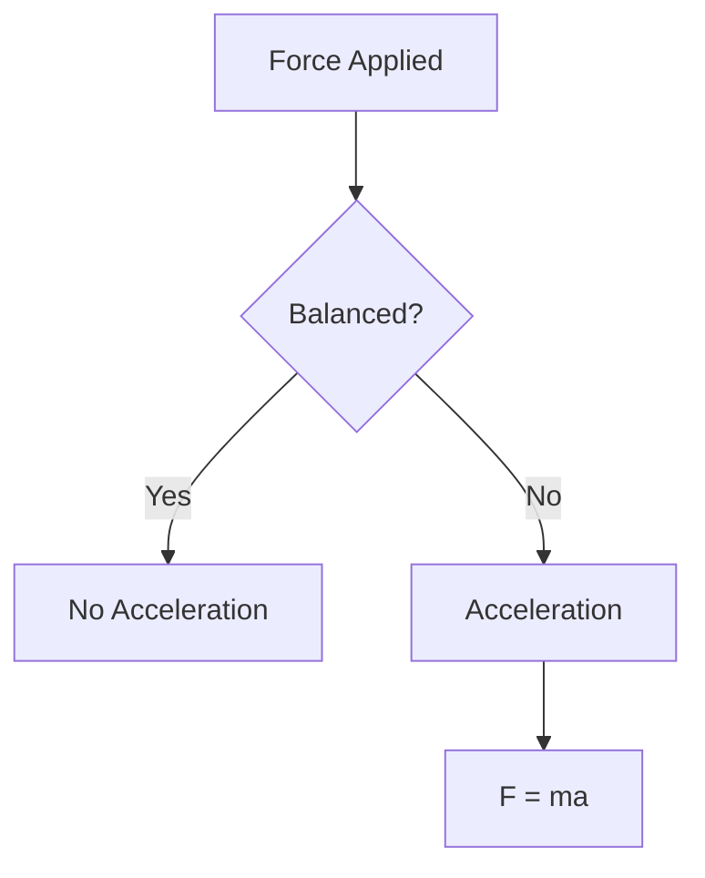
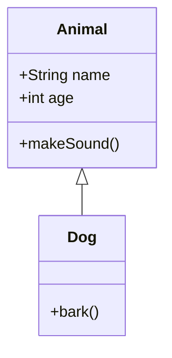

# SKILL: GRID - Gathering Resources In Detail

> **Purpose:** Author, maintain, and publish notes for the GRID notes app.
> **Trigger:** Any task involving creating, editing, or managing notes in the GRID system.

---

## What is GRID?

GRID is a static notes app hosted on GitHub Pages. It serves 9th-grade students organized notes by **Subject > Chapter**. Notes are Markdown files with embedded KaTeX math, Mermaid diagrams, and inline SVGs.

**Architecture:**
- Agent (you) writes Markdown files locally
- Agent pushes to GitHub
- GitHub Pages serves the site
- Users read notes in the browser

---

## File Structure

```
data/
├── index.json              ← Master index of all notes
├── subjects.json           ← Subject definitions (read-only)
└── notes/
    ├── physics/
    │   ├── ch7-motion/
    │   │   └── newtons-first-law.md
    │   └── ch8-force-and-laws/
    ├── chemistry/
    ├── biology/
    ├── mathematics/
    ├── social-science/
    ├── english/
    ├── kannada/
    ├── artificial-intelligence/
    └── art/
```

---

## Note File Format

Every note file MUST have YAML frontmatter:

```markdown
---
title: "Newton's First Law of Motion"
subject: physics
chapter: ch7-motion
tags: [definition, theorem]
color: yellow
pinned: false
created: 2026-08-08T10:00:00Z
updated: 2026-08-08T10:00:00Z
---

# Newton's First Law of Motion

## Statement
> An object remains in its state of rest or uniform motion unless acted upon by an external unbalanced force.
```

### Frontmatter Fields

| Field | Required | Type | Description |
|-------|----------|------|-------------|
| `title` | Yes | string | Human-readable note title |
| `subject` | Yes | string | Subject ID (from subjects.json) |
| `chapter` | Yes | string | Chapter ID (from subjects.json) |
| `tags` | No | array | Tags from vocabulary below |
| `color` | No | enum | `red` `green` `yellow` `blue` `purple` |
| `pinned` | No | boolean | Pin to top of chapter list |
| `created` | Yes | ISO timestamp | When the note was created |
| `updated` | Yes | ISO timestamp | Last modification time |

### File Naming

- **Kebab-case slugs**: `newtons-first-law.md`, `quadratic-formula.md`
- **Never**: spaces, capitals, UUIDs, or numbered prefixes
- **Subject/chapter directories**: match IDs from `subjects.json`

---

## Color Labels

| Color | Meaning | When to use |
|-------|---------|-------------|
| `red` | Exam Priority | High-frequency exam topic, study FIRST |
| `green` | Mastered | Fully covered, no revision needed |
| `yellow` | In Progress | Partially covered, needs more work |
| `blue` | Optional | Supplementary, low exam probability |
| `purple` | Reference | Formulas, cheat sheets, quick references |

---

## Tag Vocabulary

### Core Tags (use these first)
- `formula` - contains mathematical formulas
- `diagram` - contains visual diagrams
- `definition` - defines a concept
- `theorem` - states a theorem or law
- `example` - worked examples
- `homework` - practice problems
- `comparison` - compares concepts
- `summary` - chapter/section summary
- `diagram::geometry` - geometry-specific diagrams
- `diagram::graph` - graphs/charts

### Custom Tags (agent can create)
Any freeform string is allowed. Examples:
- `board-exam-frequent` - appears frequently in board exams
- `important-chapter` - chapter-level importance marker
- `ncert-textbook` - aligned with NCERT textbook
- `practical` - related to practical/lab work

---

## Subject IDs

| Subject | ID | Icon |
|---------|----|------|
| Physics | `physics` | atom |
| Chemistry | `chemistry` | flask-conical |
| Biology | `biology` | leaf |
| Mathematics | `mathematics` | sigma |
| Social Science | `social-science` | globe |
| English | `english` | book-open |
| Kannada | `kannada` | languages |
| Artificial Intelligence | `artificial-intelligence` | brain |
| Art | `art` | palette |

---

## Chapter IDs

### Physics
- `ch7-motion` - Ch.7 Motion
- `ch8-force-and-laws` - Ch.8 Force & Laws of Motion
- `ch10-mechanical-properties` - Ch.10 Mechanical Properties of Solids

### Chemistry
- `ch3-atoms-molecules` - Ch.3 Atoms & Molecules
- `ch4-structure-of-atom` - Ch.4 Structure of Atom

### Biology
- `ch1-fundamental-unit-of-life` - Ch.1 Fundamental Unit of Life
- `ch2-tissues` - Ch.2 Tissues

### Mathematics
- `ch1-number-systems` through `ch8-quadrilaterals`

### Social Science
- `history-ch4`, `geography-ch2`, `pol-science-ch3`, `pol-science-ch6`, `pol-science-ch7`, `economics-ch2`

---

## Markdown Syntax Guide

### KaTeX Math

**Inline math** - wrap in single `$`:
```markdown
The equation $E = mc^2$ shows mass-energy equivalence.
```

**Display math** - wrap in double `$$`:
```markdown
$$
F = ma
$$

The quadratic formula:

$$
x = \frac{-b \pm \sqrt{b^2 - 4ac}}{2a}
$$
```

**Common KaTeX commands:**
```markdown
$\frac{a}{b}$          → fraction
$\sqrt{x}$             → square root
$\sqrt[3]{x}$          → cube root
$x^2$                  → superscript
$x_1$                  → subscript
$\sum_{i=1}^{n} x_i$  → summation
$\int_0^1 f(x) dx$    → integral
$\vec{F}$              → vector
$\hat{i}$              → unit vector
$\alpha, \beta, \gamma$ → Greek letters
$\leq, \geq, \neq$     → comparisons
$\rightarrow, \leftarrow$ → arrows
```

### Mermaid Diagrams

Wrap in ` ```mermaid ` code blocks:

````

````

**Flowchart syntax:**
```
graph TD/R/LR/TB
    A[Node] --> B[Node]
    A -->|label| C[Node]
    B --> D{Decision}
    D -->|Yes| E[Node]
    D -->|No| F[Node]
```

**Class diagram:**
````

````

### Inline SVG

For geometry diagrams, embed raw SVG directly in Markdown:

```markdown
<svg width="300" height="250" viewBox="0 0 300 250" xmlns="http://www.w3.org/2000/svg">
  <!-- Right-angled triangle -->
  <polygon points="50,200 50,50 250,200" fill="none" stroke="#2D6A4F" stroke-width="2"/>
  <!-- Right angle marker -->
  <polyline points="50,180 70,180 70,200" fill="none" stroke="#2D6A4F" stroke-width="1.5"/>
  <!-- Labels -->
  <text x="40" y="130" font-family="Inter" font-size="14" fill="#1B4332">a</text>
  <text x="140" y="215" font-family="Inter" font-size="14" fill="#1B4332">b</text>
  <text x="160" y="110" font-family="Inter" font-size="14" fill="#1B4332">c</text>
  <!-- Vertices -->
  <circle cx="50" cy="200" r="3" fill="#2D6A4F"/>
  <circle cx="50" cy="50" r="3" fill="#2D6A4F"/>
  <circle cx="250" cy="200" r="3" fill="#2D6A4F"/>
</svg>
```

**SVG conventions for GRID:**
- Use `stroke="#2D6A4F"` (forest green) for lines
- Use `fill="#D8F3DC"` (light green) for fills
- Use `font-family="Inter"` for text labels
- Keep viewBox dimensions reasonable (300-500px)
- Always include `xmlns="http://www.w3.org/2000/svg"`

### Tables

```markdown
| Concept | Formula | Unit |
|---------|---------|------|
| Speed | $v = \frac{d}{t}$ | m/s |
| Force | $F = ma$ | N |
| Energy | $E = \frac{1}{2}mv^2$ | J |
```

### Blockquotes (for key statements)

```markdown
> **Newton's First Law:** An object remains in its state of rest or uniform motion in a straight line unless compelled by an external force to change that state.
```

---

## Index Management

After creating or editing a note, update `data/index.json`:

```json
{
  "version": "1.0.0",
  "generated": "2026-08-08T00:00:00Z",
  "notes": [
    {
      "id": "newtons-first-law",
      "title": "Newton's First Law of Motion",
      "subject": "physics",
      "chapter": "ch7-motion",
      "tags": ["definition", "theorem"],
      "color": "yellow",
      "pinned": false,
      "created": "2026-08-08T10:00:00Z",
      "updated": "2026-08-08T10:00:00Z"
    }
  ]
}
```

**Rules:**
- `id` matches the filename without `.md`
- Sort notes by `pinned` first, then by `updated` descending
- Update `generated` timestamp whenever index changes
- Keep metadata in sync with frontmatter

---

## Quality Checklist

Before publishing any note, verify:

- [ ] **Frontmatter complete** - all required fields present
- [ ] **Title is descriptive** - not just "Chapter 7 Notes"
- [ ] **Content depth** - explains concepts, not just lists
- [ ] **Formulas correct** - KaTeX renders properly
- [ ] **Diagrams clear** - SVGs are labeled and readable
- [ ] **Examples included** - at least 2-3 worked examples
- [ ] **Key terms bolded** - important terms are highlighted
- [ ] **Tables used** - for comparisons and data
- [ ] **Blockquotes** - for laws, theorems, key statements
- [ ] **Tags assigned** - relevant tags from vocabulary
- [ ] **Color label** - if the note is exam-critical or reference
- [ ] **Index updated** - note entry added to index.json
- [ ] **File named correctly** - kebab-case slug
- [ ] **Spell check** - no typos in content
- [ ] **Math verified** - all formulas render without errors

---

## Content Writing Rules

### Depth
- Explain WHY, not just WHAT
- Give context before formulas
- Connect concepts to real-world examples
- Use analogies for abstract ideas

### Structure
- Start with a clear statement or definition
- Break into logical sections with `##` headers
- Use `###` for sub-concepts within a section
- End with a summary or key takeaways

### Formatting
- **Bold** key terms on first use
- *Italic* for emphasis or Latin terms
- `Code` for variable names, symbols, units
- Blockquotes for laws, theorems, important statements
- Tables for comparisons, formulas, data
- Lists for steps, properties, features

### Math
- Always use KaTeX for formulas, never plain text
- Define variables after introducing a formula
- Show units for physical quantities
- Include worked examples with substituted values

### Diagrams
- Use SVG for geometry (triangles, circles, angles)
- Use Mermaid for flowcharts, concept maps, processes
- Always label axes, vertices, key points
- Use consistent colors (green theme)

---

## Workflow: Creating a Note

1. **Identify** the subject and chapter
2. **Choose** a template from `templates/` directory
3. **Write** the note content following quality rules
4. **Add** frontmatter with all required fields
5. **Save** as `data/notes/{subject}/{chapter}/{slug}.md`
6. **Update** `data/index.json` with the new note entry
7. **Verify** KaTeX renders, SVGs display, Mermaid diagrams work
8. **Git push** to deploy

---

## Workflow: Updating a Note

1. **Read** the existing note
2. **Update** content as needed
3. **Update** `updated` timestamp in frontmatter
4. **Sync** metadata in `index.json`
5. **Git push** to deploy

---

## Git Workflow

```bash
# Create or edit notes
# ...

# Stage changes
git add data/

# Commit
git commit -m "notes: add {note-title} to {subject}/{chapter}"

# Push to deploy
git push origin main
```

**Commit message convention:**
- `notes: add <title>` - new note
- `notes: update <title>` - edit existing
- `notes: reorganize <subject>` - structural changes

---

## Templates

Use these templates as starting points. Located in `templates/` directory:

| Template | Use for |
|----------|---------|
| `formula-note.md` | Math/science formula sheets |
| `diagram-note.md` | Geometry/graph notes |
| `definition-note.md` | Concept definitions |
| `comparison-note.md` | Comparing concepts |
| `summary-note.md` | Chapter summaries |
| `example-note.md` | Worked examples |

Copy the relevant template, fill in the content, save with correct filename.

---

## Edge Cases

### Chapter doesn't exist yet
Create the chapter directory and add the note. The `subjects.json` defines expected chapters - follow that structure.

### Multiple notes per chapter
Allowed. Each note covers a sub-topic. Use `pinned: true` for the most important note.

### Very long notes
Split into multiple notes. One note per concept is ideal. Cross-reference with links.

### Diagrams too complex for SVG
Use Mermaid for process flows. For complex geometry, create a simplified SVG with key elements only.

### Formulas with special characters
Use KaTeX escape sequences: `\frac`, `\sqrt`, `\sum`, etc. Test before publishing.

---

## Quick Reference

| What | How |
|------|-----|
| Math inline | `$E = mc^2$` |
| Math display | `$$ F = ma $$` |
| Diagram | ` ```mermaid ` block |
| Geometry | Inline `<svg>` |
| Table | Markdown pipe syntax |
| Quote | `> **Bold statement**` |
| Bold | `**text**` |
| Italic | `*text*` |
| Code | `` `code` `` |
| Link | `[text](url)` |
| Image | `` |
