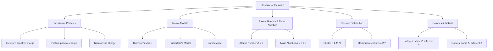

# Structure of the Atom - Summary

## Key Concepts

| # | Concept | Key Point |
|---|---------|-----------|
| 1 | Sub-atomic Particles | Atom contains electrons (−), protons (+), and neutrons (0) |
| 2 | Thomson's Model | Atom is a positively charged sphere with electrons embedded like seeds in a watermelon |
| 3 | Rutherford's Model | Atom has a dense, positively charged nucleus with electrons revolving around it |
| 4 | Bohr's Model | Electrons revolve in fixed circular orbits (shells) at specific energy levels |
| 5 | Electron Distribution | Shells: K(2), L(8), M(18), N(32) - maximum capacity = 2n² |
| 6 | Valency | Combining capacity of an atom; determined by electrons in outermost shell |
| 7 | Atomic Number | Number of protons = atomic number (Z) |
| 8 | Mass Number | Protons + neutrons = mass number (A) |
| 9 | Isotopes | Same Z, different A (same protons, different neutrons) |
| 10 | Isobars | Same A, different Z (different elements with same mass number) |

## Key Formulas

| Formula | Variables | When to Use |
|---------|-----------|-------------|
| $$Z = p = e^-$$ (in neutral atom) | $Z$ = atomic number, $p$ = protons, $e^-$ = electrons | To find atomic number |
| $$A = p + n$$ | $A$ = mass number, $n$ = neutrons | To find mass number |
| $$n = A - Z$$ | $n$ = neutrons | To find number of neutrons |
| $$\text{Max electrons in shell} = 2n^2$$ | $n$ = shell number | To find electron capacity of a shell |

## Key Diagrams

## Definitions to Remember

> **Atom:** The smallest particle of an element that takes part in a chemical reaction.

> **Atomic Number (Z):** The number of protons present in the nucleus of an atom.

> **Mass Number (A):** The sum of the number of protons and neutrons present in the nucleus of an atom.

> **Isotopes:** Atoms of the same element having the same atomic number but different mass numbers.

> **Isobars:** Atoms of different elements having the same mass number but different atomic numbers.

> **Valency:** The combining capacity of an atom of an element.

## Important Diagrams to Draw

- Thomson's model (positive sphere with embedded electrons)
- Rutherford's alpha particle scattering experiment setup
- Rutherford's nuclear model (nucleus with orbiting electrons)
- Bohr's model (shells K, L, M, N with electrons)
- Electronic configuration of first 20 elements

## Common Exam Questions

1. Draw Thomson's model of atom. What are its limitations?
2. Describe Rutherford's alpha particle scattering experiment. What did it establish?
3. Draw Bohr's model of atom. How is it different from Rutherford's model?
4. Write the electronic configuration of elements with atomic numbers 1-20.
5. Define isotopes. Give two examples. Why do isotopes have same chemical properties?
6. Define isobars. Give examples.
7. What is valency? How is it determined from electronic configuration?
8. Why do noble gases have zero valency?

## Quick Revision Points

- Atom has three sub-atomic particles: electron, proton, neutron
- Thomson's model: plum pudding model - positive sphere with electrons
- Rutherford's model: nuclear model - dense nucleus with orbiting electrons
- Bohr's model: fixed orbits with specific energy levels
- Electron distribution: K=2, L=8, M=18, N=32
- Valency = electrons needed to complete octet (or lose extra electrons)
- Isotopes: same Z, different A (e.g., ¹H, ²H, ³H)
- Isobars: same A, different Z (e.g., ⁴⁰Ar, ⁴⁰K, ⁴⁰Ca)
- Atomic number = number of protons
- Mass number = protons + neutrons

## Study Tips

- Practice drawing all three atomic models - this is frequently asked
- Memorize electronic configurations of elements 1-20
- Understand the difference between isotopes and isobars with examples
- Know the rules for electron filling: 2n² maximum per shell, 8 in outermost
- Relate valency to the number of electrons in the outermost shell
