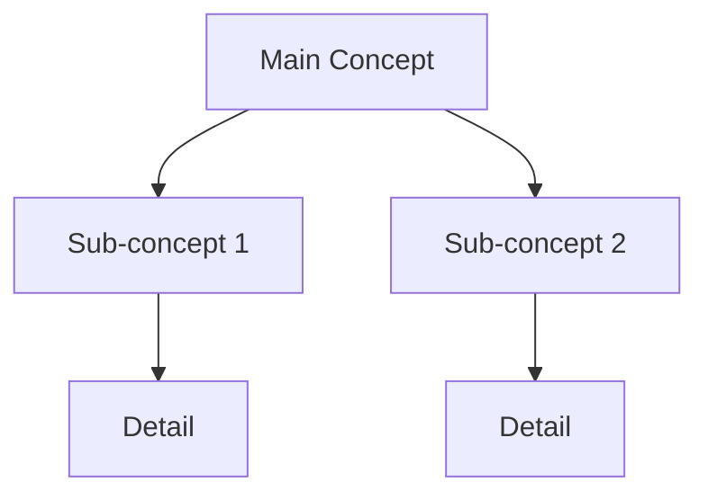

# {Chapter Name} - Summary

## Key Concepts

| # | Concept | Key Point |
|---|---------|-----------|
| 1 | | |
| 2 | | |
| 3 | | |

## Important Formulas

| Formula | Name | When to Use |
|---------|------|-------------|
| $$ | | |
| $$ | | |

## Key Diagrams

## Definitions to Remember

> **Term 1:** Definition

> **Term 2:** Definition

> **Term 3:** Definition

## Common Exam Questions

1. {Question type 1}
2. {Question type 2}
3. {Question type 3}

## Quick Revision Points

- Point 1
- Point 2
- Point 3
- Point 4
- Point 5

## Study Tips

- Tip 1
- Tip 2
- Tip 3

## Resources

- Related note: [Link](#)
- Related note: [Link](#)
